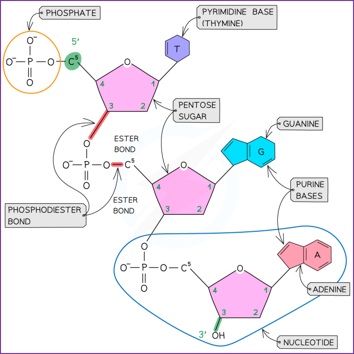
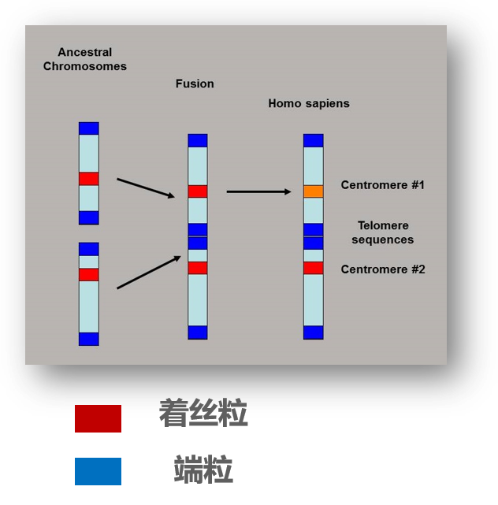

本篇主要是清华大学杨扬老师 2025 秋季学期《现代生物学导论》课程 PPT 知识汇总，以便期末复习. 部分地方包含个人理解，如有错误请多指出 (email or pr)。
# 核酸、蛋白质与组学
## 组学 Omics

组学是一门学科，其对某种类型的生物分子进行**大规模、系统性**研究。组学不局限于研究单个分子，而是同时检测解析一定区域内**所有的**同类型分子，这个区域可以是一个细胞内，也可以是一块组织内，更可以是一个生物体内。这样，在大规模、系统性的检测下我们就可以更好地解析生物分子的组成、动态变化以及相互作用，从而**全面理解生命过程的复杂性**。一些常见的组学如下表：

|组学种类|核心研究对象|
|:---:|:---:|
|基因组学|DNA|
|表观基因组学|DNA甲基化、蛋白质修饰等|
|转录组学|RNA|
|蛋白质组学|蛋白质|
|代谢组学|小分子代谢物|

以上经典的五种组学恰好构成生物体遗传信息表达的链条：DNA $\xrightarrow{DNA 修饰调控}$ RNA $\rightarrow$ 蛋白质 (执行者) $\rightarrow$ 代谢物 (功能产物)。因而组学之间也并不是独立关系，他也可以综合分析，从而一项前沿研究就是 **多组学整合分析**。

## DNA 结构与功能
先来回顾 DNA 的化学组成：DNA 是一种聚合物分子，其基本构成分为三类——**磷酸**、**五碳糖**(脱氧核糖)和**含氮碱基**(ATCG)。DNA 功能很多，DNA 能**储存遗传信息**，**稳定**且**可复制**，其多样性能**产生生物多样性**。DNA 的基本构成是如何组成这个分子的？DNA 是如何实现这些复杂功能的？这都需要逐级来了解 DNA 的构成找到答案。

### DNA 一级结构 (分子层面)
了解 DNA 一级结构需要分为两大方向：**特点**与**应用**。

#### DNA 一级结构特点

DNA 一级结构的特点是**多聚核苷酸单链** (具体核苷酸是脱氧核糖核苷酸)，不同核苷酸之间通过磷酸二酯键连接，而 DNA 单链的序列就体现在不同核苷酸中碱基 ATCG 的排列顺序上。基于磷酸二酯键的连接方式，我们可以来规定 **DNA 的方向**：磷酸二酯键形成于两个核苷酸之间，具体过程为一个核苷酸 5' 碳上的磷酸基团，与另一个核苷酸 3' 碳上的羟基 $-\mathrm{OH}$ 发生脱水缩合反应。那么一条 DNA 单链总会有一端有自由的磷酸基团，称为 5' 端，另一端有自由的羟基，称为 3' 端。DNA 的方向就规定为 **5' 端到 3' 端**，5' 端称为**起始端**，3' 端称为**终止端**。

> **补充说明**：核苷酸五碳糖(脱氧核糖)中各个碳存在编号，其编号方式为从氧原子开始，逆时针遍历所有碳原子并依次取编号为 1, 2, 3, 4, 5，称为 $i^\prime$ 碳，$i=1,2,3,4,5$。在这种编号方式下，核苷酸的五碳糖总是 1' 碳连接含氮碱基，3' 碳连接羟基，5' 碳连接磷酸基团，且 5' 碳并不在环结构中。

> **Example 1**：在 DNA 分子中，A-T 碱基对通过两个氢键连接，而更稳定的 G-C 碱基对通过三个氢键连接。如果 DNA 的稳定性随着 DNA 的突变能力的上升而下降，下列哪种基因的演化历史最久？
> 
> A. A-T 50%, G-C 50%
> 
> B. A-T 46%, G-C 54%
> 
> C. A-T 40%, G-C 60%
> 
> D. A-T 70%, G-C 30%
> 
> **Answer**: C.
> 依据题干给出的知识，显然**氢键连接更多的 G-C 碱基对稳定性更好**，那么当然是 G-C 碱基对占比越多的基因越稳定，也就是演化历史越久。

#### DNA 一级结构应用

DNA 一级结构的应用是基因组学的研究内容，而这部分研究都离不开 DNA 测序技术。DNA 测序技术的关键在于，首先要**区分 ATCG 四种碱基对** (通过标记)，而后还需要**确定每种碱基在一段序列中所在位置** (通过 DNA 链合成)。有测序技术后，便可以研究两个层面的问题：

- 寻找生物间演化关系：如人类是如何从黑猩猩、大猩猩、红毛猩猩演化而来？
- DNA 指纹鉴定：DNA 亲子鉴定中比对的是什么 DNA？

对于第一个问题，首先需要明确一下背景：人类染色体有 23 对，而黑猩猩、大猩猩与红毛猩猩的染色体都有 24 对，人类又与这些猩猩拥有共同祖先，那么在演化过程中共同祖先的染色体应该是减少一对，同时人类和猩猩性状相近且都能独立发育成一类生物，说明**染色体数量可能发生改变**，但**遗传稳定性是不变的**。因而问题转换为：什么机制可能导致演化过程中染色体数目减少，但是遗传信息没有丢失？

在生物学中回答一个问题通常需要提出一个假说，然后用**假说演绎法**(if/then)来验证假说的合理性，进而得到问题的答案。对于以上问题，我们提出一个关于这个机制的假说：人类染色体在演化过程中发生了融合。融合染色体具有以下长度和序列上的特点：融合后染色体长度大致为融合前染色体长度之和，而**着丝粒、端粒**则会在融合过程中消失一半，更准确地来说，两条染色体中两个端粒融合，不再称为端粒，而其中一个着丝粒失活或消失。经实验验证，这个假说是成立的，因而可以认为演化过程中染色体数目减少，但是遗传信息没有丢失是因为染色体发生了融合。

> **补充知识**：**着丝粒**存在于真核生物染色体上的功能区域(序列)中，主要参与细胞分裂 (详见有丝分裂全过程及减数分裂全过程)，而**端粒**是染色体末端的序列，其与 DNA 复制相关 (详见细胞衰老的端粒学说)。

对于第二个问题，需要明确人类基因组具有以下特性：
- **共同性**：全人类共享 99.9% 以上的 DNA 序列，其确保遗传密码基本结构的一致，使得人类 DNA 可以比对。
- **差异性**：不同个体的基因组存在 <0.1% 的差异，这使得不同个体的基因组具有独特性。

同时，基因序列中还存在一种特殊的区域，称为 **VNTR** (Variable Number Tandem repeats，可变数目的串联重复序列)。VNTR 是指一段具有高度重复性的核酸区域，其具有数量可变的多个重复单位。如果 VNTR 出现在一段基因序列中，那么重复单位的不同数量就会导致 VNTR 长度不同，进而导致基因序列的长度是不一样的。不同长度的 VNTR 在 PCR 扩增后分子量差距会更大，且电泳可根据分子量大小差异分离分子，那么亲子鉴定的方法就为：寻找多个 VNTR 位点 (大概是十几个到几十个)，做 **PCR 扩增**和**电泳**检测，观察条带分布。所以 DNA 亲子鉴定中对比的是包含 VNTR 的 DNA。

### DNA 二级结构
DNA 二级结构则涉及到 DNA 的空间结构，其聚焦在两条 DNA 单链的相互作用之上。

#### 碱基互补配对
两条 DNA 链在连接形成空间结构时，碱基之间遵循 Watson-Crick 碱基配对规则，即**碱基互补配对**，同时两条 DNA 链为**反向平行**关系。碱基互补配对是 **DNA 复制的基础**，碱基精准配对保证**遗传物质的稳定**，在生物遗传中具有重要意义。

> **注意**：碱基互补配对规则同时适用于 DNA 和 RNA，不过碱基互补配对的方式不同，在 DNA 中为 A-T, C-G，而在 RNA 中是 A-U, C-G。

碱基互补配对规则也给出了一些 DNA 二级结构层面的应用：核酸杂交与 DNA Origami (DNA 折纸术)。核酸杂交是利用 DNA 或 RNA 单链之间碱基互补配对形成稳定双链结构的特性，检测特定 DNA 序列在 DNA 样本中的存在、大小与含量。而 DNA Origami 则是在纳米结构上利用 DNA 碱基配对的氢键折叠 DNA，让 DNA 形成特定的三维结构，具体实现细节不做过多阐释。

> **Example 2** DNA 结构特点中允许 DNA 进行复制的是
> 
> A. 糖-磷酸骨架
> 
> B. 含氮碱基的互补配对
> 
> C. DNA 形成螺旋型
> 
> D. 核苷酸的三个基本组成元件
> 
> **Answer**: B

#### 双螺旋
经由碱基互补配对，两条 DNA 会形成一种空间螺旋结构，称为 **DNA 双螺旋**。双螺旋的外围是糖-磷酸骨架，内部是含氮碱基形成的氢键。To be continue...