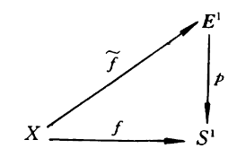

## QuickReview
上周介绍完基本群的基本概念和相关定义，开始讨论 $S^1$ 基本群的相关概念与性质. 在 $S^1$ 基本群中，我们引入了以下概念：一个道路 $a$ 的 **提升** (lift) $\tilde{a}$, 以及 $a$ 的 **圈数** (number of loops/cycles) $q(a)$，最后停留在 $q(a)$ 的定义：

$$
    q(a) := \tilde{a}(1) - \tilde{a}(0)
$$

$q(a)$ 是整数. 

## $S^1$ 的基本群
### 道路提升定理
暂时先回到最开始我们构造的一些空间映射关系

对于一条道路 $a$，这给出 $a$ 与其提升 $\tilde{a}$ 的关系 $ p \circ \tilde{a} = a $. 基于这个关系可以给出一个找提升的定理：

> **Theorem(道路提升定理)** 设 $p: \mathbb{E} \to B$ 为一个覆盖映射，$a: I \to B$ 是一条道路，且 $t\_0 \in \mathbb{E}$ 满足 $p(t\_0) = a(s\_0)$，则存在唯一的 $a$ 的提升 $\tilde{a}: I \to \mathbb{E}$ 满足 $p \circ \tilde{a} = a, \tilde{a}(s\_0) = t\_0$. 

(标准形式的定理貌似是要求 $a(0) = p(t\_0), \tilde{a}(0) = t\_0$)

**简要证明** 

考虑到 $p = e^{i2\pi t}$，将提升形式直接代入关系式并取对数就可以得到一个代数表达

$$
    \tilde{a}(s) = \frac{1}{i2\pi} \ln a(s)
$$

在取定 $a(s\_0) = p(t\_0)$ 时，上式保证 $\tilde{a}(s\_0)$ 满足 $\tilde{a}(s\_0) = p(t\_0)$. 结合复变中 $\ln z$ 多值函数的行为，初值保证 $\ln a(s\_0)$ 对应某一主值分支上的值，后由解析延拓可以让 $\ln a(s)$ 连续分支唯一确定，因而上式可以保证 $\tilde{a}(s)$ 的唯一性. 

**简要证明完成**.

设 $a(s)$ 的辐角函数为 $f(a)$，这种形式的提升 $\tilde{a}$ 恰好就是 $\frac{f(a)}{2\pi}$. 基于 $\ln z$ 的性质，在不同初值时 $a$ 的提升 $\tilde{a}$ 之间相差初值之差，这个初值之差在 $a(s)$ 固定的约束下恰好是整数. 圈数的定义就可以表述为以下形式：

> **Definition(圈数)** 设 $\tilde{a}$ 是 $a$ 的提升，$a$ 的所有提升构成集合 $\{ \tilde{a}(s) + k \| k \in \mathbb{Z} \}$. 定义 $q(a) = \tilde{a}(1) - \tilde{a}(0)$，称为 $a$ 的 **圈数**. 

基于这个定义就可以明显地看出 $q(a)$ 不依赖于 $a$ 提升的选取，仅依赖于 $a$.

> **Example** 可以定义一个道路 $a(s) = e^{i2\pi \lambda s}$，基于前面取提升的方法可以得到一个提升 $\tilde{a}(s) = \lambda s$，那么 $a$ 的圈数 $q(a) = \lambda$.

### 圈数相关引理
下面介绍圈数的一些引理.

> **Lemma 3** 若 $a, b$ 是 $S^1$ 上基点为 $z\_0$ 的两条闭路，且 $\forall s \in I, a(s) \neq -b(s)$，则 $q(a) = q(b)$.

反证法，若 $q(a) \neq q(b)$，则分别取起点相同的提升 $\tilde{a}, \tilde{b}$ 满足

$$
    \tilde{a}(0) = \tilde{b}(0), \tilde{a}(1) = \tilde{b}(1) + k, k \in \mathbb{Z}
$$

由于提升都是连续映射，因而可以构造连续映射 $f(s) = \tilde{a}(s) - \tilde{b}(s): I \to \mathbb{E}^1$，其满足 $f(0) = 0, f(1) = k$. $a, b$ 地位相等，不妨认为 $k > 0$，由连续映射介值定理，一定存在 $s\_0 \in I$，使得 $f(s\_0) = \frac{1}{2}$. 这样 

$$
    a(s_0) = e^{i2\pi \tilde{a}(s_0)} = e^{i2\pi \tilde{b}(s_0) + i\pi} = -b(s_0)
$$

这与条件矛盾，因而 $q(a) = q(b)$. 这个结论可用于引理 4 的证明.

> **Lemma 4**(**定端同伦** $\Leftrightarrow$ **圈数相同**) 设 $a, b$ 是 $S^1$ 上基点为 $z\_0$ 的闭路(课上写的形式为 $a, b$ 是 $S^1$ 上端点相同的道路)，则 $a \underset{\cdot}{\simeq} b \Longleftrightarrow q(a) = q(b)$.

**证明** 

先证明 $\Longleftarrow$：$a, b$ 圈数相同，依定义分别有提升 $\tilde{a}, \tilde{b}$ 满足 

$$
q(a) = \tilde{a}(1) - \tilde{a}(0) = \tilde{b}(1) - \tilde{b}(0) = q(b)
$$

再取一个 $a$ 的提升 $\tilde{a}^\prime(s) = \tilde{a}(s) - m, \tilde{a}^\prime(0) = \tilde{b}(0), m \in \mathbb{Z}$. 代入上式得到 $\tilde{a}^\prime(1) = \tilde{b}(1)$，$\tilde{a}^\prime$ 与 $\tilde{b}$ 的起终点一样，就有 $\tilde{a}^\prime \underset{\cdot}{\simeq} \tilde{b}$ 即 $a \underset{\cdot}{\simeq} b$. (这里显然可以**直接取起点相同的两个提升**，但为复刻原汁原味的基础拓扑学课堂我们严格按照板书书写.)

再来证明 $\Longrightarrow$：设 $a \overset{H}{\underset{\cdot}{\simeq}} b$，其中伦移满足 $H(s, 0) = a(s), H(s, 1) = b(s), H(0, t) = H(1, t) = z\_0 \in S^1$. 取映射 

$$
    q(t)=H(1, t): I \to \mathbb{Z}, s \in I
$$

$q(t)$ 是连续的(这是同伦提升定理能够给出的结论). 基于连通性的判定，$q(t)$ 显然是连通的，又由于 $\mathbb{Z}$ 是离散空间，连通性要求 $q(I) = z \in \mathbb{Z}$，即 $q(0) = q(1)$. $H$ 是一致连续的，取 $H$ 在 $t$ 方向上的切片 $h\_t = H(s, t)$，则

$$
\forall \epsilon > 0, \exist \delta > 0, | t_1 - t_2 | < \delta, \hspace{3ex} \forall s \in I, |H(s, t_1) - H(s, t_2)| < \epsilon
$$

这也就意味着 $h_{t\_1}(s) \neq - h_{t\_2}(s), \forall t \in I$，基于引理 3 的结论有 $q(h_{t\_1}) = q(h_{t\_2})$，即 $q(h\_t)$ 不依赖于 $t$. 那么就可以取 $t = 0, 1$ 得到 $q(a) = q(b)$.

**证明完成**.

### $S^1$ 基本群
板书定义 $S^1$ 的基本群为 $ \pi\_1(S^1, 1) = \\{ c, I,  0, 1 \to S^1, 1, 1\\} / {\underset{\cdot}{\simeq}} $，这实在是太丑陋了，$S^1$ 基本群的定义符合基本群的标准定义，为

$$
    \pi_1(S^1, z_0) = \{ [\alpha] | \alpha: I \to S^1 \text{ 连续}, \alpha(0) = \alpha(1) = z_0  \}
$$

$S^1$ 是**道路连通**的，其在任意基点处的基本群都是**同构**的，为计算方便取定 $z_0 = 1, p(t) = e^{i2\pi t}$，可以定义一个映射 $\Phi: \pi\_1(S^1, 1) \to \mathbb{Z}$ 为

$$
    \Phi([a]) = \tilde{a}(1) = q(a), \forall [a] \in \pi\_1(S^1, 1)
$$

这依据前面的道路提升定理，$\tilde{a}: I \to \mathbb{E}^1$ 是唯一的，且 $\tilde{a}(0) = 0, p(\tilde{a}(1)) = a(1) = 1$，因而 $\tilde{a}(1) \in p^{-1}(1) = \mathbb{Z}$，从而这种构造是合理的. 

可以证明 $\Phi$ 是**一个同构**：首先 $\Phi$ 是良定义的，映射结果不依赖于代表元选取. 取 $[a], [b] \in \pi\_1(S^1, 1)$，其代表元 $a, b$ 的提升满足 $\tilde{a}(1) = \tilde{b}(0)$，那么

$$
\begin{aligned}
    \Phi([a][b]) &= \tilde{ab}(1) \\
    &= \tilde{b}(1) - \tilde{a}(0) \\
    &= \tilde{b}(1) - \tilde{b}(0) + \tilde{a}(1) - \tilde{a}(0) \\
    &= q(a) + q(b) \\
    &= \Phi([a]) + \Phi([b])
\end{aligned}
$$

依引理 4, $\Phi$ 是**单同态**，由于 $\Phi([a]) = \Phi([b])$ 等价于 $[a] = [b]$. 取 $a$ 的形式为 $a(s) = e^{i2\pi s}, s \in I$，有 $\Phi([a]) = 1$，则对任意正整数 $n$，有 $\Phi(a^n) = n, \Phi(a^{-n}) = -n$，因而 $\Phi$ 能够映射到全整数 $\mathbb{Z}$ 中，那么 $\Phi$ 是**满同态**. $\Phi$ 既是单同态，又是满同态，因而是 $\pi\_1(S^1, z\_0)$ 和 $\mathbb{Z}$ 两个空间之间的同构，即 $\pi\_1(S^1, z\_0) \cong \mathbb{Z}$.

基于 $\Phi$，$S^1$ 的基本群中元素实际由一个整数 $n$ 唯一确定，因而可以将 $\pi\_1(S^1, 1)$ 写为以下形式：

$$
    \pi_1(S^1, 1) = \{ \left[s \mapsto e^{i2\pi n s}\right] \| n \in \mathbb{Z}\}
$$

这是合理的. 由于 $\mathbb{Z}$ 是自由循环群，而 $S^1$ 基本群又同胚于它，我们就可以写出 $S^1$ 基本群满足的一个定理：

> **Theorem 4.3** $\pi\_1(S^1, z\_0)$ 是自由循环群(无限循环群)，即同构于 $\mathbb{Z}$.

自由循环群的详细概念可以参考 [Wikipedia 循环群](https://zh.wikipedia.org/wiki/%E5%BE%AA%E7%92%B0%E7%BE%A4). 定理说明 $\pi\_1(S^1, 1)$ 中元素数量与 $\mathbb{Z}$ 中元素数量相同，可直接导出以下推论

> **Corollary** $S^1 \ncong \mathbb{E}^1$.

由于 $\pi\_1 (\mathbb{E}^1, 1)$ 中元素只有一个, 二者拓扑性质不同，很自然可以得出这个推论. 

## $S^n$ 基本群
在介绍 $S^n$ 基本群之前，先来研究一些有关于单连通的命题.

> **Proposition 4.11** 设 $X\_1, X\_2$ 是 $X$ 的开集，$X = X\_1 \cup X\_2$. $X\_1 \cap X\_2$ 非空且道路连通, $X\_2$ 单连通，则 $i\_\pi: \pi\_1(X\_1, x\_0) \to \pi\_1(X, x\_0), x\_0 \in X\_1$ 满同态, $i: X\_1, X$ 是包含映射.

以球面 $S^2$ 为例，设球面相对的两个点 (连线过球心) 为 $P, Q$，可以构造

$$
    S^2 = (S^2 - P) \cup (S^2 - Q)
$$

满足命题所设要求，依照命题结论应该有 $i\_\pi: \pi\_1(S^2 - P) \to \pi\_1(S^2)$ 满同态，那么 $\pi\_1(S^2)$ 与 $\pi\_1(S^2 - P)$ 性质类似，其应当是单连通的. 在 $n = 1$ 时由于切开的两个开集不连通，因而无法应用此命题. 下面来尝试证明这个命题.

**证明** 

满同态意味着若 $a \in \pi\_1(X, x\_0)$，则有 $b \in \pi\_1(X\_1, x\_0)$ 使得 $i\_\pi(b) = a$，即等价于 $i \circ b \underset{\cdot}{\simeq} a$. 这就只需要证明 $X$ 上闭路 $a$ 定端同伦于 $X\_1$ 上某条闭路. 

$\\{ a^{-1}(X\_1), a^{-1}(X\_2) \\}$ 构成 $I$ 的开覆盖，存在正的 lebesgue 数 $\delta$. 若 $\|c - d \| < \delta$，则 $(c, d)$ 仅是两个开集其中一个的子集. 取正整数 $m > \frac{1}{\delta}$，对 $I$ 做 $m$ 等分，那么就有

$$
    a_k = a\left( \left[ \frac{k}{m}, \frac{k+1}{m} \right] \right) \subset X_1 \text{ or } X_2
$$

分割点集合为 $\\{ \frac{1}{m}, \frac{2}{m}, \cdots, \frac{m-1}{m} \\}$.

希望只处理 $X\_2$ 上的道路段，因而可以取 $a$ 中某条道路段 $a\_k \subset X\_2$, 其相邻的道路 $a\_{k-1}, a\_{k+1}$ 也只会在 $X\_1$ 或 $X\_2$ 中. 若同属于 $X\_2$，则可以与 $a\_k$ 合并为一条更长的道路段，再次重复以上取的操作. 最后总会得到相邻的两条道路同属于 $X\_1$，则分割点 $a(\frac{k}{m}), a(\frac{k+1}{m})$ 应该同属于 $X\_1 \cap X\_2$ 中. 由 $X\_1 \cap X\_2$ 的道路连通性，就存在道路

$$
    b_k: I \to X_1 \cap X_2, b_k(0) = a \left( \frac{k}{m} \right), b_k(1) = a \left( \frac{k+1}{m} \right)
$$

这样 $a_k$ 与 $b_k$ 有相同的起终点，由于 $X\_2$ 是单连通的，则 $a\_k \underset{\cdot}{\simeq} b\_k$. $b\_k$ 在交集中，因而可以替换 $a\_k$. 对所有分段做相同操作就可以构造出新的闭路 $a^\prime: I \to X\_1$，容易得到 $a \underset{\cdot}{\simeq} a^\prime$，即要证明的结论. 因而命题成立.

**证明完成**.

这个命题有一个推论：

> **Corollary** 若 $X$ 是其两个单连通开集 $X\_1, X\_2$ 的并集，并且 $X\_1 \cap X\_2$ 非空，道路连通，则 $X$ 也单连通.

这个推论证明很简单，先用开覆盖子集道路连通与交集非空可以得到 $X$ 道路连通，再用上面这个定理可以得到子集交集处点作基点的基本群也是平凡群即得证.

## $T^2$ 基本群
研究完 $S^n$ 的基本群，接下来来研究 $T^n$ 的基本群. 考虑 $T^2 = S^1 \times S^1$，因而研究 $T^2$ 基本群的性质需要先研究乘积空间基本群的定理：

> **Theorem 4.4** 设 $x\_0 \in X, y\_0 \in Y$，则 $\pi\_1(X \times Y, (x\_0, y\_0)) \cong \pi\_1(X, x\_0) \times \pi\_1(Y, y\_0)$.

类似于 $S^n$ 基本群与 $\mathbb{Z}$ 同胚定理的证明，这里的同胚也要求我们给出一个**同构函数**. 

**证明** 

构造映射 $\varphi: \pi\_1(X \times Y, (x\_0, y\_0)) \to \pi\_1(X, x\_0) \times \pi\_1(Y, y\_0)$ 的表达式为：

$$
    \varphi(\gamma) = \left( (j_1)_\pi(\gamma), (j_2)_\pi(\gamma) \right), \forall \gamma \in \pi_1(X \times Y, (x_0, y_0))
$$

$j\_1, j\_2$ 分别是 $X \times Y$ 到 $X, Y$ 的投射，这是一个同态的良定义，可以任取代表元. 

先验证 $\varphi$ 是满同态. 任取 $[a] \in \pi\_1(X, x\_0), [b] \in \pi\_2(Y, y\_0)$，$X \times Y$ 中的闭路形式可以为 $c(s) = (a(s), b(s))$，代入就有 $\varphi([c]) = ([a], [b])$，因而 $\varphi$ 是满射.

再验证 $\varphi$ 是单同态. 设 $[c] \in \pi\_1(X \times Y, (x\_0, y\_0))$，有 $\varphi([c]) = 1$. 这样投射到两个空间的道路应该定端同伦于点道路， $j\_1 \circ c \underset{\cdot}{\simeq} e\_{x\_0}, j\_2 \circ c \underset{\cdot}{\simeq} e\_{y\_0}$. 规定映射

$$
    H(s,t)=(H_1(s, t), H_2(s,t)): I \times I \to X \times Y \\
    H_1: j_1 \circ c \underset{\cdot}{\simeq} e_{x_0}, H_2: j_2 \circ c \underset{\cdot}{\simeq} e_{y_0}
$$

这很容易验证 $H: c \underset{\cdot}{\simeq} e_{x_0, y_0}$，即 $c$ 均同伦于$(x_0, y_0)$ 处的点道路，那么 $\varphi([a]) = \varphi([b]) \Leftrightarrow [a] = [b]$，因而 $\varphi$ 是单同态.

所以 $\varphi$ 是同构，因而两个空间同胚.

**证明完成** 

依这个定理就很容易得到 $T^2$ 基本群的推论：

> **Corollary 1**: $\pi\_1(T^2) \cong \mathbb{Z} \times \mathbb{Z}$.

当然这个推论也可以直接通过前面的定理和引理在 $T^2$ 上证明. 由于 $\pi\_1(S^2) \cong \mathbb{Z}$，因而还可以得到一个推论.

> **Corollary 2**: $T^2 \ncong S^2$.
