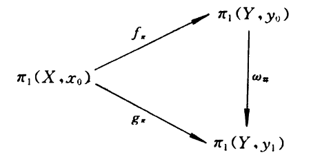

## 基本群的同伦不变性
### 同伦映射导出的基本群同态关系
对于同伦 $f \overset{H}{\simeq} g: X \to Y$，连续函数之间可进行转换，那么基于连续函数的基本群同态 $f\_\pi$ 应该也可以类似地转换为 $g\_\pi$. 

伦移 $H: f \simeq g$ 应该满足 $H(x\_0, 0) = f(x\_0), H(x\_0, 1) = g(x\_0), x\_0 \in X$. 可以规定 

$$
w(t) = H(x\_0, t): I \to Y, x\_0 \in X, t \in I
$$

表示 $Y$ 中一条道路，这是从 $f(x\_0)$ 到 $g(x\_0)$ 的一条道路，称为 $H$ 在 $x\_0$ 处的 **踪**. 该道路类 $\omega = \bra \omega \ket$ 有同构 $\omega\_\\#:\pi\_1(Y, f(x\_0)) \to \pi\_1(Y, g(x\_0))$.

> **Theorem 4.5 (基本群同态间的图表交换)** 设 $f \overset{H}{\simeq} g: X \to Y$，则 $g\_\pi = \omega\_\\# \circ f\_\pi: \pi\_1(X, x\_0) \to \pi\_1(Y, g(x\_0)$，即满足以下可交换图表
> 
> 其中特殊标记 $y\_0 = f(x\_0), y\_1 = g(x\_0)$.

这个证明暂且详见讲义，后续会补全这一块的证明. 先来看一个例子：

> **Example 1** 设拓扑空间 $X=Y=S^1 = \\{ e^{\theta i} \\}$，$H$ 满足
> 
> $$
>   H \left( e^{\theta i}, t \right) = e^{(2\theta + \pi t)i} \\
>   H \left(e^{\theta i}, 0 \right) = e^{2\theta i}, H \left( e^{\theta i}, 1 \right) = e^{2\theta i + \pi i} = -e^{2\theta i} 
> $$
> 
> $S^1$ 基本群 $\pi\_1(S^1, e^{0 i} = 1) = \\{ a\_k \| k \in \mathbb{Z} \\}$，这就是两个拓扑空间的基本群. 此时的同态 $f\_\pi = g\_\pi = H(\cdot, 0)\_\pi$. 考虑之前在 $S^1$ 基本群中讨论过的代表元道路 $a\_k(s) = e^{2\pi ksi}, k\in\mathbb{Z}$，这表示绕圆转 $k$ 圈的回路. 应用 $f\_\pi$ 对应关系会得到一个同构关系
> 
> $$
>   a_k(s) \mapsto \{ H(a_k(s), 0) \}_{S \in [0, 1]} = \{ e^{4\pi ks i} \}_{S \in [0, 1]} = a_{2k}(s)
> $$
> 
> 那么 $f\_\pi$ 诱导的同态就是将回路的绕数翻倍，$a\_k \mapsto a\_{2k}$. 对 $g\_\pi$ 做类似操作也会得到相同结果.

**代数基本定理** 就可以用这种方法证明.

> **Theorem (代数基本定理)** $n \geq 1$，复多项式
> 
> $$
>   p(z) = z^n + a_{n-1}z^{n-1} + \cdots + a_1z + a_0
> $$
> 
> 必有零点.

反证法，设 $p(z)$ 不存在零点，就可以取连续映射

$$
    f_r(z) = \frac{p(rz)}{\| p(rz) \|}: S^1 \times \mathbb{R} \to S^1, r \in \mathbb{R}
$$

特殊情况 $r=0$，此时 

$$
    f_0(z) = \frac{p(0)}{\| p(0) \|} = \frac{a_0}{\| a_0 \|}
$$

这是一个常值函数. 再取一个极限情况 $r \to +\infty$，则

$$
\begin{aligned}
    f_r(z) &= \lim_{r \to +\infty} \frac{p(rz)}{\| p(rz) \|} \\
    &= \lim_{r\to + \infty} \frac{r^n + a_{n-1}r^{n-1}z^{n-1} + \cdots + a_1 rz + a_0}{\|r^n + a_{n-1}r^{n-1}z^{n-1} + \cdots + a_1 rz + a_0\|} \\
    &= \frac{z^n}{\| z^n \|} \\
    &= z^n, \text{ if } z \in S^1
\end{aligned}
$$

那么就存在 $r\_0$，当 $r > r\_0$ 时，$\| f\_r(z) - z^n \| < 1$，依据讲义 105 页例 2 就可判定 $f\_0(z) \simeq g(z) = z^n$，也就是说常值函数 $\simeq g$. 依据交换图表关系，$g$ 的同态与常值函数的同态存在一一对应关系，这也就意味着 $g$ 也是一个常值，这显然是矛盾的. 因而假设不成立， $p(z)$ 应该存在零点，证毕. 

### 拓扑空间的同伦等价
连续映射可以定义同伦关系，类似也可以定义拓扑空间之间的同伦关系：

> **Definition 4.8 (拓扑空间同伦等价)** 设 $X$ 与 $Y$ 为两个拓扑空间. 如果存在连续映射 $f: X \to Y, g: Y \to X$，使得
> 
> $$
> g \circ f \simeq \mathrm{id}_X: X \to X, f \circ g \simeq \mathrm{id}_Y: Y \to Y
> $$
>
> 则 $X$ 与 $Y$ 是 **同伦等价** 的，记作 $X \simeq Y$. $f, g$ 为同伦等价(映射)，互为同伦逆.

同伦等价关系引出关于同伦的一个推论：

> **Corollary**: 若 $f: X \to Y, g: Y \to X$ 是同伦等价，则对于道路 $a, b: I \to X$ 有
> 
> $$
>   g_\pi f_\pi(a) = w^{-1} \mathrm{id}(a) w \\
>   f_\pi g_\pi(b) = v^{-1} \mathrm{id}(b) v 
> $$

$g\_\pi \circ f\_\pi, f\_\pi \circ g\_\pi$ 的一一对应关系给出 $f\_\pi, g\_\pi$ 均是单同伦也是满同伦，因而 $f\_\pi, g\_\pi$ 是同构，因而有复合恒等映射关系. 下面来看一个例子：

> **Example**: $\mathbb{E}^3 \simeq \mathbb{E}^2$.

记 $f: \mathbb{E}^3 \to \mathbb{E}^2, g: \mathbb{E}^2 \to \mathbb{E}^3$，满足 $f(x, y, z) = (x, y), g(x, y) = (x, y, z)$(诡异). 规定 $H: \mathbb{E}^3 \times I \to \mathbb{E}^3$ 为

$$
    H(x, y, z, t) = (x, y, (1-t)z), t \in I
$$

那么 $H$ 是 $g \circ f$ 与 $\mathrm{id}_{\mathbb{E}^3}$ 的一个同伦，因而由定义 $\mathbb{E}^3 \simeq \mathbb{E}^2$.

### 形变收缩核
上面的那个例子是形变收缩核的一个特例，下面给出形变收缩核的定义.

> **Definition 4.9 (形变收缩核)** 设 $A \subset X$，包含映射 $i: A \to X$. 若存在收缩映射 $r: X \to A$, 即满足 $r \circ i = \mathrm{id}_A$，使得 $i \circ r \simeq \mathrm{id}_X: X \to X$，就称 $A$ 为 $X$ 的一个**形变收缩核**.

在以上定义中很容易看出 $r$ 与 $i$ 互为同伦逆，因而 $A \simeq X$. 基于形变收缩核就可以定义**形变收缩**过程. 

> **Definition 4.9a (形变收缩)** 设 $A \subset X$，连续映射 $H: X \times X \to X$ 满足
>
> $$
> \begin{aligned}
>    H(x, 0) = x, &\forall x \in X \\
>    H(x, 1) \in A, &\forall x \in X \\
>    H(a, t) = a, &\forall a \in A
> \end{aligned}
> $$
> 
> 则称 $H$ 为 $X$ 到 $A$ 的一个形变收缩. 

(`TODO`: 此处应该有个关于 Mobius 带的例子.)

## 基本群的计算与应用
### Van-Kampen 定理

> **Theorem 4.7 (Van-Kampen 定理)** 设拓扑空间 $X$ 可以分解为两个开集之并，$X = X\_1 \cup X\_2$，其中 $X\_0 = X\_1 \cap X\_2$ 非空且道路连通，则 $\forall x\_0 \in X\_0$，有
> 
> $$
>   \pi_1(X, x_0) = \frac{\pi_1(X_1, x_0) * \pi_1(X_2, x_0)}{[(i_1)_\pi(\alpha) (i_2)_\pi (\alpha^{-1}) | \alpha \in \pi_1(X_0, x_0)]}
> $$
> 
> 以上分数表示商空间，其中 $i\_l: X\_0 \to X\_l$ 为包含映射.

先看一下群论里的一些例子. 整数模 4 的加法循环群 $\mathbb{Z}_4 = \\{ [0], [1], [2], [3] \\}$，其可尝试用乘法群来表示

$$
    \{ c^n | n \in \mathbb{Z} \} / c^4 \sim 1 = \{ 1, c, c^2, c^3 \}
$$

群论中群的结构可以用生成元和生成元满足的关系表示，上述过程即是通过用生成元 c, 关系 $c^4 = 1$ 来表示整数模 4 群 $\mathbb{Z}_4$. 同样对于二元自由阿贝尔群

$$
    \mathbb{Z}_2 = \bra a, b | ab \sim ba (aba^{-1}b^{-1} \sim 1)\ket
$$

拥有生成元 $a, b$ 与关系 $ab = ba$ 后，就可以生成 $\mathbb{Z}_2$ 其中的元素，如 $aba = a^2b, ab^2a^{-1} = b^2$，因为这个交换群中生成元顺序可任意调换.

