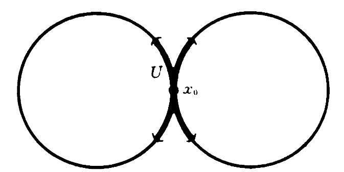
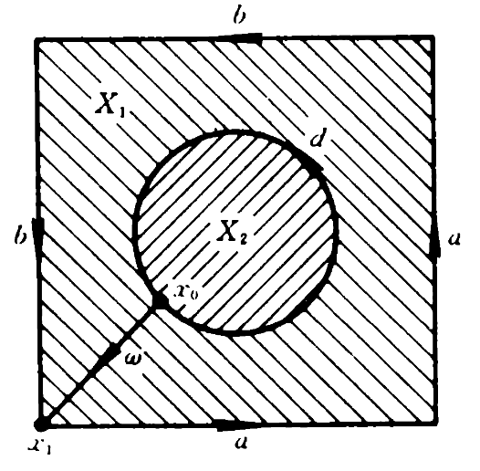
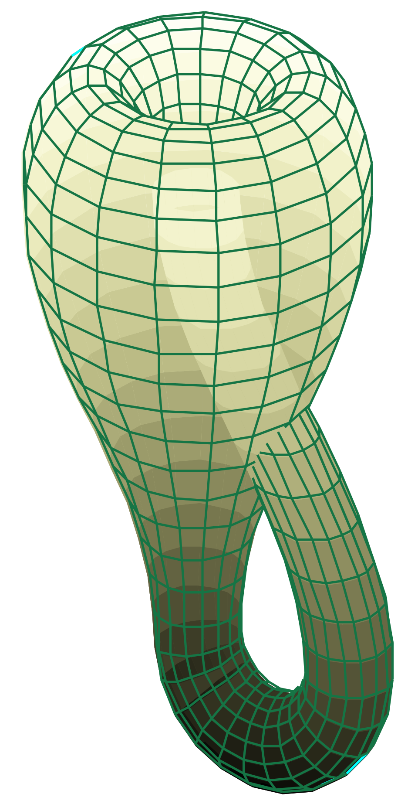
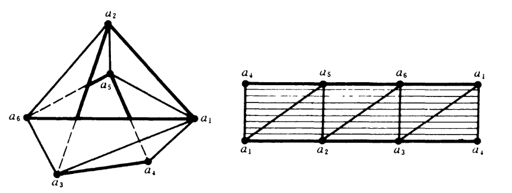

## 基本群的计算与应用
### Van-Kampen 定理的应用
上周初探 Van-Kampen 定理，下面来看看这个定理的一个应用. 

> **Example 1** 记圆束为 $\underset{i=1}{\overset{n}{\vee}} S\_{i}^1$，尝试求 $n = 2$ 时圆束的基本群. 示意图如下
> 

$n = 2$ 时圆束就可以表示为 $X = S\_1^1 \vee S\_2^1$，分别记 $S\_i^1$ 为 $X\_i, i = 1, 2$，可知 $X\_0 = X\_1 \cap X\_2$ 就是两个圆的重叠部分，即一个点 $\\{ x\_0 \\}$. 这个点是其**某个开邻域 $U$ 的强形变收缩核**，那么这就满足 Van-Kampen 定理的条件. 回顾之前研究 $S^1$ 基本群，可知

$$
    \pi_{1}(X_1, x_0) = \{ b^n | n \in \mathbb{Z} \} \\
    \pi_1(X_2, x_0) = \{ c^n | n \in \mathbb{Z} \} \\
    \pi_1(X_0, x_0) = [1]
$$

代入标准 Van-Kampen 定理，有

$$
    \pi_1(X, x_0) \simeq \frac{\pi_1(X_1, x_0) * \pi_2(X_2, x_0)}{i_1(1) \sim i_2(1)} = \{ b^{q_1}c^{v_1} \cdots b^{q_n}c^{v_n} | q_i, v_i \in \mathbb{Z} / {0} \text{ 但首项可为 } 0\} \simeq \mathbb{Z} * \mathbb{Z}
$$

> **Example 2** Klein 瓶的基本群.

首先明确 Klein 瓶的表示，Klein 瓶是一个矩形 M 两对邻边按如下图 $a, b$ 箭头方向粘接得到的商空间 $X$.

因而研究 Klein 瓶应该从这个矩形出发来研究，尝试给矩形分出两个开集，$X\_1$ 为矩形外周一圈，$X\_2$ 为矩形内部，二者交集 $X\_0 = X\_1 \cap X\_2$ 就为二部分重叠得到的一个小闭环. 想到闭环就是有宽度的圆，因而很容易写出 $X\_0 \cong S^1 \times (-\epsilon, \epsilon)$，这样

$$
    \pi_1(X_0) = \{ d^n | n \in \mathbb{Z} \}
$$

这是一个非空且道路连通的空间，则满足 Van-Kampen 定理. 接下来只需要研究 $X\_1, X\_2$ 的基本群就可以表示出 Klein 瓶的基本群. $X\_2$ 是一个凸集，那么基本群是平凡基本群，$\pi\_1(X\_2, x\_0) = \{ 1 \}$. 比较难表示的是 $X\_1$ 的基本群，回到矩形中，Klein 瓶定义中的粘合操作表明两对邻边将会独立形成两个曲面，且两个曲面交于一点 $x\_0$，这 $x\_0$ 即是矩形 $M$ 任意边角的顶点. $X\_1$ 是一个有边界的曲面，那么 $X\_1$ 就同胚于 **Example 1** 中研究的圆束，其基本群就很好写出

$$
    \pi_1(X_1, x_0) \simeq \mathbb{Z} * \mathbb{Z} = \{ a^n | n \in \mathbb{Z} \} \times \{ b^n | n \in \mathbb{Z} \}
$$

可以认为 $a, b$ 是如示意图所示左侧边界的两条道路，依据 Van-Kampen 定理，有

$$
    \pi_1(X, x_0) = \frac{\left( \{ a^n | n \in \mathbb{Z} \} \times \{ b^n | n \in \mathbb{Z} \} \right) * \{ 1 \}}{i_1(d) \sim i_2(d)} = \frac{\{ a^n | n \in \mathbb{Z} \} \times \{ b^n | n \in \mathbb{Z} \}}{ab^{-1}a^{-1}b^{-1} \sim 1}
$$

严格按图中标出的道路字母，可以表示为

$$
    \pi_1(X, x_0) \simeq [a, b | a^\mathbb{Z} b^\mathbb{Z}]
$$

Klein 瓶在三维空间中画出来如下图所示：

绕瓶颈一圈的道路即为 $a$，沿瓶颈绕瓶身内外一圈的道路即为 $b$，所以 Klein 瓶基本群的分母道路表示为 $ab^{-1}a^{-1}b^{-1}$ 是合理的，且可以随机交换 $ab^{-1}$ 和 $b^{-1}c^{-1}$. 类似地，环面的基本群就可以按照相似的表示写出

$$
    \pi_1(\text{环}) = [a, b | aba^{-1}b^{-1} \sim 1] \simeq \mathbb{Z} * \mathbb{Z}
$$

环面中 $ab = ba$，因而分母道路可以任选. 

## 单纯同调群
正常来说，基础拓扑学在基本群后就结束了，此处为授课基本群结束时的即兴讲授，因而相较于前面的内容会忽略大批量的定义和命题，仅介绍和基本群相关的部分.

### 单纯复合形
先为单纯形下一个定义：

> **Definition 6.1 (单纯形)** 欧氏空间中处于一般位置，或称为几何无关的 $n+1$ 个点 $\\{ a\_0, \cdots, a\_n \\}$ 的凸包称为一个 $n$ 维单纯形，简称 $n$ 维单形.

那么单纯复合形就是单纯形为元素的一个集合，其中每两个单形规则相交. 考虑 Mobius 带，$C$ 是 Mobius 带的中心线，或称腰圆，在作业中我们已经证明得到这两个集合基本群的同态

$$
    i_\pi: \pi_1(C) \to \pi_1(M)
$$

不是同构，而是一个 $\mathbb{Z} \to \mathbb{Z}\_{\text{偶}}$ 即乘 2 的同态. 尝试将 Mobius 带剖分为一个个单形，在 2 维空间中单纯形是三角形，那么这一步就是将 Mobius 带剖分为一系列三角形，如下图右侧所示.

左侧为剖分后的 Mobius 带的示意图. Mobius 带边界道路 $a\_1a\_2a\_3a\_4a\_1a\_2a\_3a\_4$ 就同胚于 $a\_1a\_2a\_3a\_4a\_1a\_5a\_2a\_6a\_3a\_1$，也就是说一条道路可以用折线来表示，与分析中连续函数用线性函数逼近的想法类似.

回到 $n$ 维单纯形的定义，所谓 $\\{ a\_0, \cdots, a\_n \\}$ 中的一般位置，就是说向量 $V\_1 - V\_0, V\_2 - V\_0, \cdots, V\_n - V\_0$ 线性无关，这是与讲义中定义的条件是一致的.

### 单纯复合形的同调群

$q$ 维单纯链群 $X$ 定义为所有 $q$ 维链的集合在函数加法运算下构成的交换群，

$$
    C_q(X) = \{ \sum_i n_iv_i | v_i \text{ 是 } q \text{ 维单形 }, n_i \in \mathbb{Z} \}
$$

满足同态 $\partial: C\_q(X) \to C\_{q-1}(X)$ 为

$$
    \partial [v_0 v_1 \cdots, v_q] = \sum_{j=0}^q (-1)^j [v_0 \cdots, \hat{v_j} \cdots v_q]
$$

即去掉第 $j$ 个顶点. 下面来看一个例子理解这个同态.

> **Example 3** 已知空间中处于一般位置的四点 $v\_0, v\_1, v\_2, v\_3$，则
> 
> $$
>   C_0 = \{ \sum_{j=0}^3  n_j[v_j] | n_j \in \mathbb{Z}\}
> $$
> 
> $$
>    C_1 = \{ k_1[v_0v_1] + k_2[v_0v_2] + k_3[v_0v_3] + k_4[v_1v_2] | k_j \in \mathbb{Z} \}
> $$
> 
> 尝试写出 $\partial (-2[v\_0v\_1] + 3[v\_1v\_2])$.

直接带入同态定义式，

$$
    \partial (-2[v_0v_1] + 3[v_1v_2]) = -2 \partial [v_0v_1] + 3\partial [v_1v_2] = -2 ([v_1] - [v_0]) + 3([v_2] - [v_1]) = 2[v_0] - 5[v_1] + 3[v_2]
$$

有了链群，进一步定义 $q$ 维同调群：

$$
    H_q(X) = \frac{\mathrm{Ker} \partial: C_q(X) \to C_{q-1}(X)}{\mathrm{Im} \partial: C_{q+1}(X) \to C_q(X)}
$$

上式似乎等效于 $\mathrm{Ker} \partial = 0$ (未说明清楚)，衔接上一个例子来看这个同调群表达式.

> **Example 4** 容易写出 $\mathrm{Ker} \partial: C\_1 \to C\_0$ 为
> 
> $$
>   \mathrm{Ker} \partial(C_1) = \{ (-k_1 - k_2 - k_3)[v_0] + (k_1 - k_4)[v_1] + (k_2 + k_4) [v_2] + k_3[v_3]) | k \in \mathbb{Z}  \}
> $$
> 
> 令其为 0 得到 $k\_1 = -k\_2 = k_4 = k, k\_3 = 0$. 则 $1$ 维同调群为
> 
> $$
>   H_1(X) = \{ k([v_0v_1] - [v_0v_2] + [v_1v_2]) | k \in \mathbb{Z}  \}
> $$