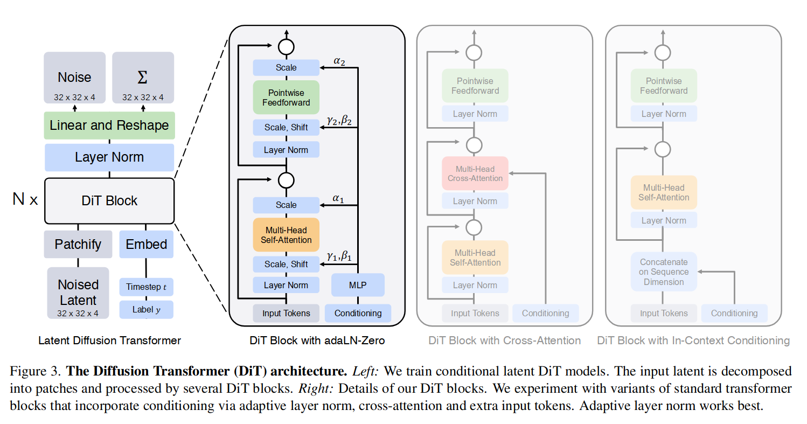

# DiT 模型架构与代码学习笔记
## DiT 模型架构

DiT 基于 Diffusion probabilistic models 和 Transformer 架构，通过在 DiT Block 中引入 MHA 来实现对多模态信息的高效处理. 想了解 DiT 首先需要对 DDPM 和 Transformer 有一定了解.

### DDPM
扩散模型主要基于数理统计与随机过程知识建立。Gaussian diffusion models 假定**前向传播过程** (forward) 是逐步向真实数据引入噪声的过程，其中各个时间步 $t$ 下的数据分布 $\{x_t\}_{t=1}^T$ 满足马尔可夫链的性质：

$$
    q(x_1, x_2, \cdots, x_T \vert x_0) = \overset{T}{\underset{t=1}{\prod}}q(x_t \vert x_{t-1})
$$

其中 $x_0$ 为初始数据，也就是真实数据。引入噪声的过程可以记作

$$
    x_0: q(x_t \vert x_0) = \mathcal{N}(x_t; \sqrt{\bar{\alpha}_t} x_0, (1 - \bar{\alpha}_t) \bm{I})
$$

也可以写作

$$
    q(x_t \vert x_{t-1}) = \mathcal(N)(\sqrt{1-\beta_t} x_{t-1}, \beta_t \bm{I})
$$

其中 $\bar{\alpha}_t, \beta_t$ 是相关的**超参数** (hyperparameters)，二者的关系是 $\bar{\alpha}_t = \overset{t}{\underset{s=1}{\prod}} (1-\beta_s)$。基于以上假设，并对数据或者说是样本进行**重整化** (reparameterization) 后，可以将样本写作

$$
    x_t = \sqrt{\bar{\alpha}_t} x_0 + \sqrt{1 - \bar{\alpha}_t} \epsilon_t, \text{ where } \epsilon_t \sim \mathcal{N}(0, \bm{I})
$$

这里的 $\epsilon$ 就是所谓的“噪声”，即服从**标准正态分布**的变量。而 Diffusion models 就在训练中学习反向传播过程，即如何去去除 $\epsilon$ 的影响，恢复前一步的图像：

$$
    p_{\theta}(x_{t-1} \vert x_t) = \mathcal{N}(\mu_{\theta}(x_t, t), \sum_\theta(x_t, t))
$$

其中 $p_\theta$ 就是神经网络需要预测的统计分布。这样操作下，扩散模型实质上就是逼近一个建立在**马尔可夫随机过程** $\{ x_t \}_{t=0}^T$ 上的映射，这个映射可以通过一个行为模式 $x_{n}$ 预测得到前一个行为模式 $x_{n-1}$ 的概率分布。

依据统计中最大似然的思想，结合数值分析中寻找极值点的思路，使得 $p_\theta$ 最大的参数 $\theta^* = \underset{\theta}{\max} \mathbb{E}_{q(x_0)}(p_\theta(x_0))$ 可以通过似然函数或是对数似然函数梯度下降来得到。扩散模型采用对数似然函数，其形式为

$$
    \log p_\theta(x_0) = \log \int p_\theta(x_{0:T}) dx_{1:T}
$$

其中 $p_\theta (x_{0:T})$ 的结构表示 $p_\theta$ 关于 $\{x_i\}_{i=0}^T$ 的联合分布。这积分一般是不可解的，所以需要用到一个称为变分下界 (Evidence low bound, ELBO)的方法进行逼近。引入真实数据分布，并利用 Jensen 不等式有

$$
    \log p_\theta(x_0) = \log \int q(x_{1:T} \vert x_0) \frac{p_\theta(x_{0:T})}{q(x_{1:T} \vert x_0)} dx_{1:T} \geq \mathbb{E}_{q(x_{1:T} \vert x_0)} \left[ \log \frac{p_\theta(x_{0:T})}{q(x_{1:T} \vert x_0)} \right]
$$

带入先前推导的 $p_\theta (x_{t-1} \vert x_t), q(x_t \vert x_{t-1})$ 那么扩散模型的对数似然函数形式可以展开为以下形式，此处采用 DDPM 论文中的化简版本 *(Ho et al., 2020)*:

$$
    \mathcal{L}(\theta) = \mathbb{E}_q \left[ D_{KL}(q(x_T \vert x_0) \parallel p(x_T)) + \sum_{t>1} D_{KL} (q(x_{t-1} \vert x_t, x_0) \parallel p_\theta (x_{t-1} \vert x_t)) - \log p_\theta (x_0 \vert x_1)\right]
$$

其中 $D_{KL}$ 为 $KL$ 散度，用来衡量两个概率分布间差异的量，定义式为

$$
    D_{KL} (P \parallel Q) = \mathbb{E}_{x \sim P} \left[ \log \frac{P(x)}{Q(x)} \right], \text{ where } P, Q \text{ denote the statistics.}
$$

因而逐层分析对数似然函数，会发现其中每一项都具有一定意义

$$
D_{KL}(q(x_T \vert x_0) \parallel p(x_T))
$$

表示加噪过程中第 $T$ 时间步的数据 $q(x_T \vert x_0)$ 与反向预测数据 $p(x_T)$ 的差异

$$
\sum_{t>1} D_{KL} (q(x_{t-1} \vert x_t, x_0) \parallel p_\theta (x_{t-1} \vert x_t))
$$

表示加燥过程第 $t$ 时间步的数据与反向预测生成数据 $p(x_{t-1} \vert x_t)$ 的差异, 最后一项 

$$
\log p_\theta(x_0 \vert x_1)
$$

表示模型最后一步生成干净样本 $x_0$ 的能力. 在以上假设中，DPPM 将对数似然函数简化为以下版本：

$$
    \mathcal{L}_{\text{simple}}  = \mathbb{E}_{x_0, \epsilon, t}\left[ \parallel \epsilon - \epsilon_\theta(x_t, t) \parallel^2 \right]
$$

其中 $\epsilon_\theta(x_t, t)$ 为模型预测的噪声。简化后的似然函数表示，只需要让模型学会 $t$ 时间步的噪声预测，即可学会去噪、还原干净样本。这步简化让扩散模型梯度下降训练具有可能性，是非常强大的优化。

## Transformers 
待有精力再写这部分。

## DiT模型架构
传统 DDPM 在噪声预测部分使用的是 CNN (U-Net) 结构，而 Transformer 架构在模型规模、全局信息等方面有更强大的能力，因而 DiT 通过将 U-Net 结构换为 Transformer 架构来实现更强大的图像生成能力。

[返回 back](./)
